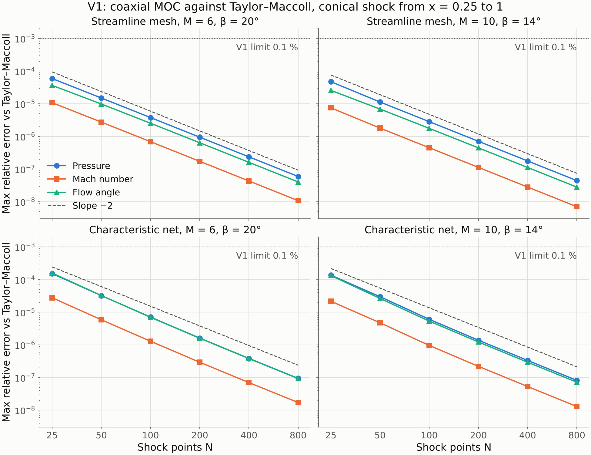
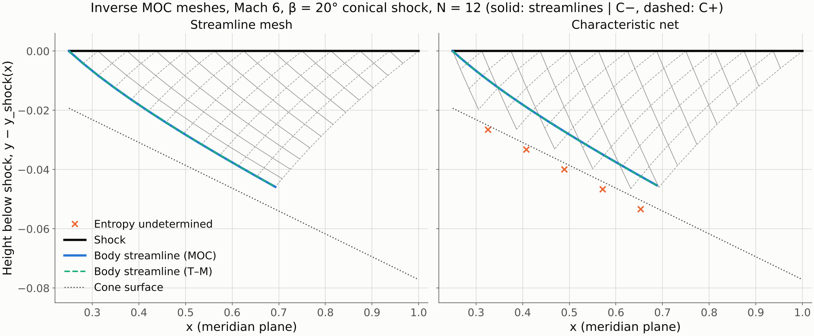
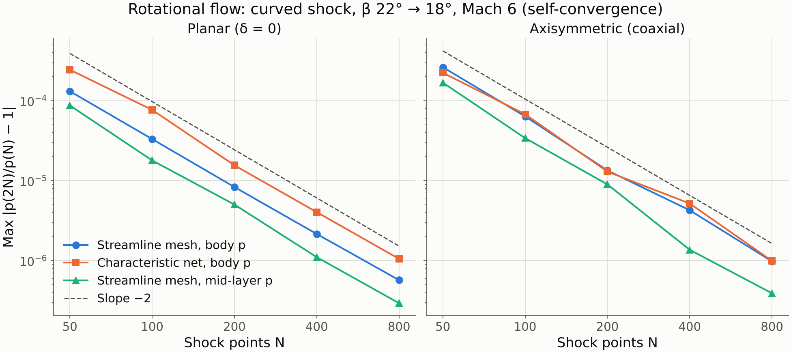
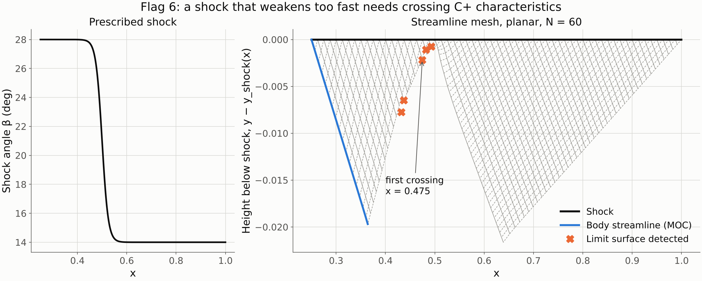

# LTOCs Gate 1 report: MOC kernel

Spec: [`LTOC_implementation_spec.md`](LTOC_implementation_spec.md), Phase 1. Gate 0: [`gate0_report.md`](gate0_report.md).
Status: **Phase 1 complete; waiting for approval before Phase 2.**

---

## 1. What was done

| File | Content |
|---|---|
| `ltoc/moc_noncoaxial.py` | Two-family rotational inverse MOC. Pluggable axis rule: planar, coaxial, offset, noncoaxial. Two mesh topologies. Limit-surface, determinacy, subsonic and axis checks. Streamline extraction. |
| `ltoc/reference.py` | Tight conical-flow reference (Taylor–Maccoll at rtol 1e−12). Reuses `liu2019.shock` and `gvwd.thermo.oblique_shock`. |
| `ltoc/viz.py` | Figure style: ≥ 14 pt, centred titles, Agg canvas, validated palette. |
| `ltoc/tests/test_moc_kernel.py` | 28 tests (V1, V2 and the extras below), about 30 s. |
| `ltoc/examples/gate1_moc_kernel.py` | Regenerates every number and figure in this report. |
| `ltoc/docs/validation.md` | Validation record (tables, tolerances, test names). |
| `.github/workflows/tests.yml` | New step `pytest ltoc/tests/ -q` (approved at Gate 0). |

Existing code was not changed. The only dependencies are numpy, scipy and matplotlib.

---

## 2. Two findings that change what Gate 0 said

### 2.1 The characteristic net over-reaches the domain of determinacy

At Gate 0 (§2, flag 2) I proposed the standard characteristic net. The streamline through each new point was to be traced back "to the previous row" (segment AB) to carry entropy.

Running it showed that behind a shock the backward streamline usually reaches the previous row **upstream of A**. The reason is that streamlines leave the shock at a shallow angle (β − θ ≈ 7.5°), whereas the C− characteristic leaves at about 21°.

Consequence: for rotational flow the region determined by shock data [A₀, A_N] is bounded below by the **streamline from A₀**, not by the C− characteristic from A₀. That streamline is exactly the waverider body in LTOCs. Below it the entropy is not determined; R3 Sec. 1.4 makes the related point about the region near the base.

I therefore implemented both topologies on one storage layout.

- **Streamline mesh.** This is R1's own topology (R1 Fig. 3, R2 Fig. 15b): a point = streamline from the previous point ∩ C+ through the point above. I added the missing C− relation, taken at the foot of the backward C− on the previous row.
  - Entropy and total enthalpy are exact, since each column is one streamline.
  - The body streamline is a native mesh line.
  - The mesh never leaves the determined region.
  - R1's Step C (triangles A₁A₂C₂, D₁C₂D₂) maps onto it directly.
- **Characteristic net** (R4 Fig. 1). C− ∩ C+ through adjacent points. The streamline foot is searched along the previous row. To keep the domain exact, the streamline's starting point on the shock is carried as a passive scalar. Points whose streamline starts upstream of A₀ are marked *entropy undetermined*; a thin band of three segments is kept so the body can be interpolated across.

Both use the C+ and the C− compatibility relations, so both satisfy flag 2.

### 2.2 Linear interpolation at the foot makes the scheme first order

The first version used linear interpolation for the C− foot (streamline mesh) and for the entropy foot (characteristic net). It converged at **first order**. The reason is that each step adds an O(h²) interpolation error, and those accumulate over O(1/h) steps.

The fix: represent the previous row by a local cubic in x, through four neighbours; at row ends, a quadratic leaning toward the foot. Then intersect the straight characteristic or streamline with that curve and interpolate every field with the same stencil. Both meshes now converge at second order (§3).

---

## 3. Results

Full tables: [`ltoc/docs/validation.md`](../../ltoc/docs/validation.md). γ = 1.4 throughout.

### V2: planar shock gives uniform flow

| | Points (N = 200) | max \|Δp/p\| | max \|Δθ\| |
|---|---|---|---|
| Streamline mesh | 20 301 | 5.2e−15 | 8.3e−16 rad |
| Characteristic net | 14 928 | 5.7e−15 | 8.6e−16 rad |

**Pass** (round-off).

### V1: conical shock, coaxial rule, Mach 6 and 10

Against the **existing** Taylor–Maccoll solver (`liu2019.shock.taylor_maccoll_cone_field`) at N = 100, the maximum error over 3 000–5 000 points is **3.8e−5 in p, 6.1e−6 in M and 6.8e−5 in θ**, against a limit of 1e−3. **Pass.** That level is set by the existing solver's own spline accuracy.

Against the tight reference, all quantities converge at **order 2.00** (streamline mesh) and 2.03 (characteristic net). The pressure error falls from 6e−5 at N = 25 to 6e−8 at N = 800.

The body streamline matches the Taylor–Maccoll streamline at N = 200:
- Streamline mesh, native column: |Δy|/L ≤ 1.7e−7 and |Δp/p| ≤ 8.7e−7.
- Characteristic net, traced streamline: pressure error 12× larger (1.1e−5). At Mach 10 the trace stops up to 10 % short of the end of the determined region, because it runs along the edge of the valid region.

The plot is height below the shock, which opens up the thin layer. The streamline mesh fills exactly the region between the shock and the body. The characteristic net extends below the body; those points are marked *entropy undetermined*. In both panels the MOC body streamline lies on top of the Taylor–Maccoll one.

### Rotational flow (beyond V1/V2)

A cone has uniform entropy, so V1 does not exercise the entropy transport. I added a curved shock at Mach 6: β goes smoothly from 22° to 18°, planar and coaxial.

- **Convergence.** Both meshes self-converge at second order. The body position converges at order 2.0; the body pressure change from N = 800 to 1600 is 6e−7 to 1e−6.
- **Agreement.** The two meshes are independent discretisations. At N = 1600 they agree to 4–7e−8 in mid-layer pressure and 1–3e−7 in body pressure.

### Flag 6: limit surfaces

A shock that weakens from 28° to 14° over Δx ≈ 0.1 needs crossing C+ characteristics just below it. Both meshes detect the crossing at the same place (x = 0.483 and 0.487), and `strict=True` raises `LimitSurfaceError`. The smooth curved shock raises nothing.

### Axis rule

- Translation invariance holds to < 1e−11.
- The noncoaxial rule built from a circular cone's own radii is bit-identical to the coaxial rule.
- A real noncoaxial case cannot be verified in isolation. Its first independent checks are V5 (Phase 3), where it must reduce to the coaxial result plane by plane, and V6/V7 (Phase 4).

### Cost

Per stream surface, the streamline mesh takes 0.6 s at N = 100 and 2.8 s at N = 400; the characteristic net takes about half that.

An LTOCs waverider needs one stream surface per leading-edge point, e.g. 40–80 of them. That is about 0.5–1 min at N = 100. This fits the spec's "seconds to minutes". The foot interpolation can be vectorised further if Phase 4 needs larger N.

---

## 4. Recommendation

Use the **streamline mesh** for the LTOCs core (Phase 3). Keep the characteristic net as an independent cross-check in the tests.

On every measure above the streamline mesh is equal or better:
- exact entropy;
- native body streamline;
- no determinacy band;
- 12× better body pressure on the cone;
- clean order-2.00 convergence.

It is also the topology on which R1's Step C and R3's adaptive refinement (spec flag 5) are defined.

## 5. Decisions needed before Phase 2

1. **Mesh for LTOCs.** Streamline mesh as the default, with the characteristic net kept as a cross-check? This departs from the "R4 Fig. 1" wording of flag 2; both meshes are two-family.
2. Nothing else is blocking. The Phase 2 plan is unchanged from Gate 0 §4: `ShockSurface` classes, `shock_geometry.py`, test V3, and maps of β and r on the R1 shocks.

## 6. What in the spec or Gate 0 turned out to be wrong

- **Gate 0 §2, flag 2.** "The streamline through the new point is traced back to the previous row" — the streamline does not cross between A and B, and the characteristic net's domain is wider than the domain of determinacy for rotational flow (§2.1).
- **Spec flag 2, "R4 Fig. 1 two-family mesh".** It needs the streamline-origin bookkeeping above to be correct behind a curved shock. The streamline topology avoids the issue.
- **Interpolation accuracy.** Not covered by the spec. Linear interpolation at the foot is first order; cubic is needed for second order (§2.2).
- **Existing Taylor–Maccoll solver.** Its accuracy is about 7e−5 in θ (rtol 1e−6, sparse knots). That is enough for the 0.1 % V1 criterion but not for convergence studies, hence `ltoc.reference`. Note for later: the solver used by the OC generator (`waverider_generator/flowfield.py`) has looser tolerances still; this matters for the V5 comparison (Gate 0 §3.7).
