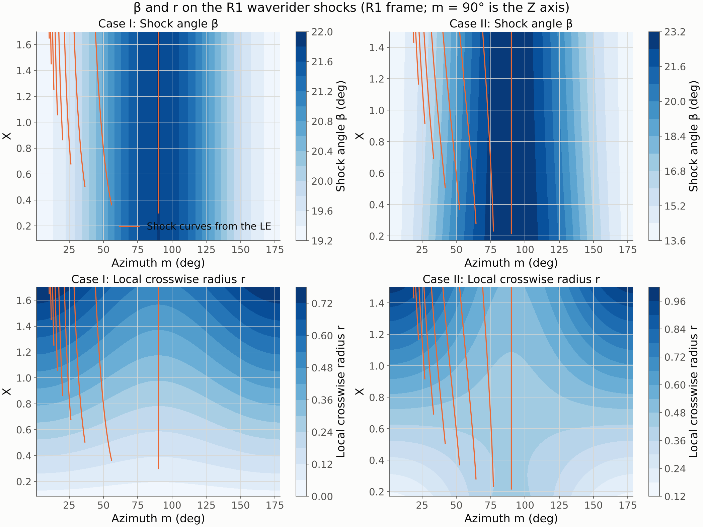
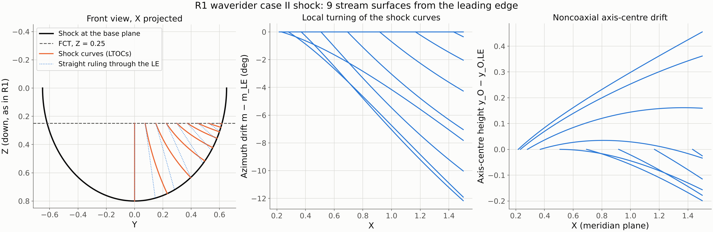
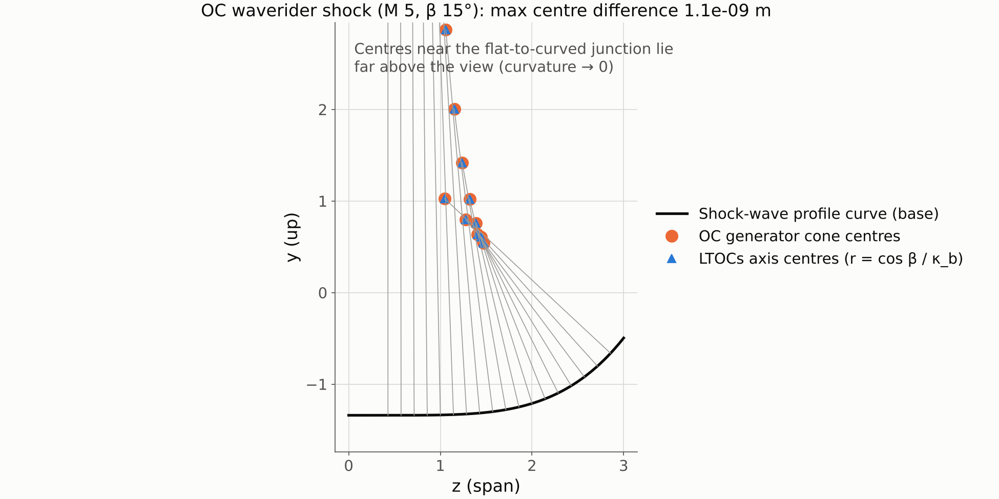

# LTOCs Gate 2 report: shock geometry

Spec: [`LTOC_implementation_spec.md`](LTOC_implementation_spec.md), Phase 2. Previous gates: [Gate 0](gate0_report.md), [Gate 1](gate1_report.md).
Status: **Phase 2 complete; waiting for approval before Phase 3.**

---

## 1. What was done

| File | Content |
|---|---|
| `ltoc/shock_surface.py` | `ShockSurface` base class (point plus exact first and second derivatives) with four implementations: `RuledShock` (R1 Eq. 12, with `RuledShock.elliptic` for R1 Eqs. 15, 18, 23, 25), `ConeShock`, `OsculatingConeShock` (with `from_oc_waverider` for a WADOS OC design) and `BSplineShock` (bicubic, from data or from another surface). |
| `ltoc/shock_geometry.py` | `local_geometry`: unit normal, β (R1 Eq. 3), shock-curve direction t (R1 Fig. 2), crosswise direction b, κ_b, r = cos β / κ_b, axis centre. `trace_shock_curves`: RK4 shock curves (R1 Sec. II.A), integrated in the surface parameters so they stay on the surface exactly, together with the intrinsic meridian ordinate (Gate 0 decision) and the flags flat, concave, sub-Mach and detached (spec flag 7). |
| `ltoc/tests/test_shock_geometry.py` | 16 tests: V3 plus the checks below. The LTOCs suite is now 44 tests, about 30 s. |
| `ltoc/examples/gate2_shock_geometry.py` | Regenerates the figures and numbers below (about 5 s). |
| `ltoc/docs/validation.md` | Phase 2 tables. |

Existing code was not changed. `OsculatingConeShock` reads its parameters from the OC generator object.

---

## 2. V3 results

| Check | Worst error | |
|---|---|---|
| Cone (β 12°, 20°, 35°): the shock curve is the generator | azimuth drift 0, β 1e−16 rad | **pass** |
| Cone: r equals the cone radius X tan β | 1e−15 | **pass** |
| Cone: axis centre on the axis; meridian ordinate rises at tan β | 7e−16; < 1e−13 | **pass** |
| Flag 1: dY/dX = −Z_X Z_Y / (1 + Z_Y²) on an elliptic cone | 2e−16 (the printed R1 Eq. 1 is off by 0.58) | **pass** |
| Flag 3: r = cos β / κ_b equals the cross-section radius (elliptic cones; R1 Eq. 18 shock by finite differences) | 1e−15; 1e−7 | **pass** |

Beyond V3:

- **`OsculatingConeShock` against the OC generator** (M 5, β 15°).
  - Base-plane shock curve and local axis centres agree with the generator's own `y_local_shockwave` and `cone_centers` to **1.1e−9 m**.
  - The shock curves stay exactly in their osculating planes.
  - β is constant, the axis centre is fixed, and dr/dx = tan β.
  - So on an OC shock, LTOCs reduces plane by plane to the coaxial MOC, and V5 in Phase 3 is a clean identity test (Gate 0 §3.7).
- **The OC generator's shock curve has a closed form.** Its quartic Bézier has its control points evenly spaced in z, so it is exactly y = −H + X₂H ξ⁴. That gives exact derivatives without root-finding.
- **`BSplineShock`** reproduces its source surface: points to 4.5e−9, β to 5.5e−8 rad, r to 8.4e−5.
- **Published shocks** (R1 Eqs. 18, 23, 25): convex, attached and above the Mach angle everywhere along the shock curves. R2's quartic shock (Eq. 13) has κ_b > 0, i.e. its centres lie on the body side, as R2 Fig. 20a shows.

---

## 3. What the geometry shows

On R1's two waverider shocks, 9 shock curves start from the leading edge (FCT projected upstream, R1 Sec. IV.A):

| | Case I (Eq. 23, M 6) | Case II (Eq. 25, M 7) |
|---|---|---|
| β on the shock | 19.3°–21.8° | 14.0°–23.2° |
| r on the shock | 0.03–0.78 | 0.17–0.98 |
| Largest azimuth drift of a shock curve, LE to base | 11.8° | 12.2° |
| Axis-centre height change along a curve (meridian) | −0.09 to +0.13 | −0.20 to +0.46 |

- **The stream surfaces are far from planar.** Starting at the leading edge, the shock curves turn by up to 12° in azimuth relative to the straight ruling through the same leading-edge point. They turn toward the Y axis, where the cross-section is flatter (figure 2, left). This is exactly the case R1 designed LTOCs for: an osculating method would force each stream surface into one plane.
- **The noncoaxial effect is large on case II.** On the centreline the local axis centre rises by 0.46, about a third of the length. On case I, an elliptic cone and therefore self-similar, the drift is smaller. Both match R1's description, "the local axis centres move away from the x axis" (R1 Sec. II.B).
- **No flags are raised on any published shock.** The flat-region handling (r = ∞) appears only on the OC shock's flat inboard part. Phase 3 will treat it as planar flow by capping r. V2 showed an axis offset of 10⁸ reproduces the planar result to 1e−7.

---

## 4. Plan for Phase 3 (LTOCs core, V4 and V5)

1. **Leading edge.** Project the FCT points upstream onto the shock (R1 Sec. IV.A) with a 2-D root solve per point.
2. **Step A.** Trace the shock curve from each LE point with `trace_shock_curves`. Extend it past the base plane until the body streamline is determined up to the base (spec flag 4); report how much extension was needed.
3. **Step B.**
   - Build the meridian initial line (x, y, β) from the curve and pass it to `shock_initial_line`.
   - Use the axis rule `AxisRule.noncoaxial(x, y_axis)`, with r capped in flat regions.
   - Solve with `solve_inverse(..., scheme="streamline")`.
   - Column 0 is the body streamline.
4. **Step C** (R1 Eqs. 10–11, vector form). Map each mesh point back to 3-D from its two parents, L and U (R1's triangles A₁A₂C₂ and D₁C₂D₂), using j ∥ V − (V·i) i/|i|². The 3-D velocity direction keeps its meridian-plane angle to the row segment.
5. **Output.**
   - `LTOCWaverider`, exposing the OC stream protocol: lower surface from the body streamlines, upper surface as the freestream surface (R1 Sec. IV.A). STL export comes through `geometry_export`.
   - Diagnostics: maps of β, r and axis-centre drift, the flags, the determinacy margin, and a spanwise smoothness metric (spec flag 8).
6. **V4.** `ConeShock` against the cone-derived waverider (`ShadowWaverider`) and the tight Taylor–Maccoll reference.
7. **V5.** `OsculatingConeShock` against the OC generator. Tolerances follow the approved Gate 0 §3.7 basis.

No decisions are needed before Phase 3 beyond approval of this gate.
