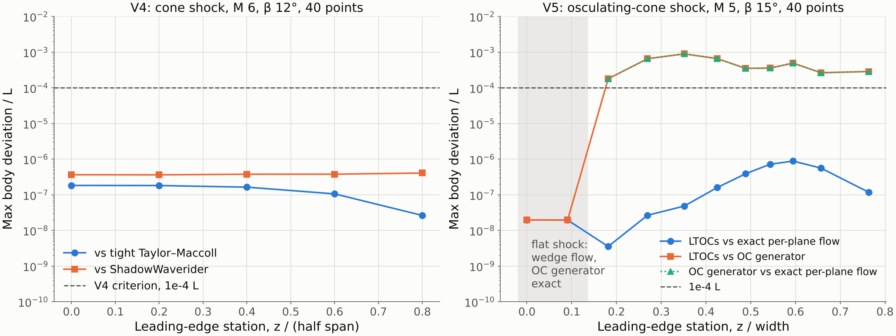
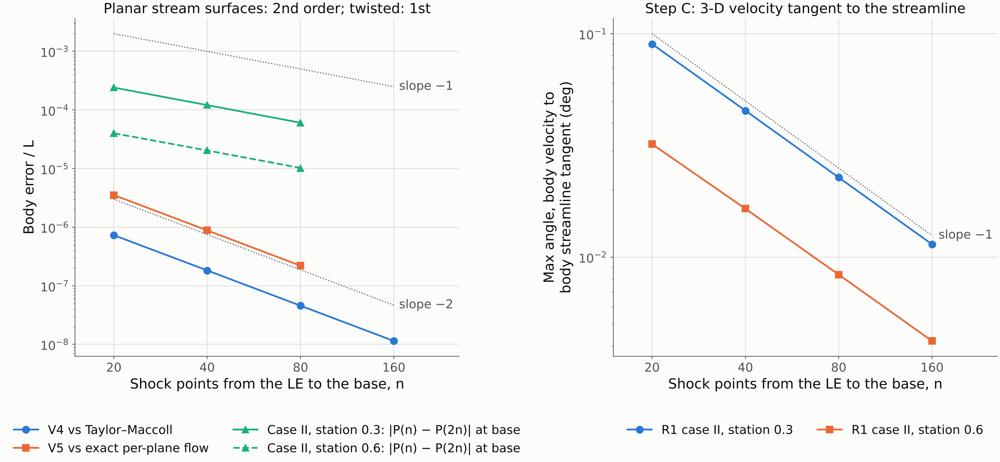
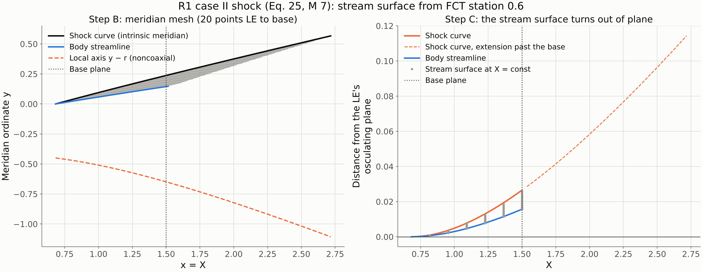
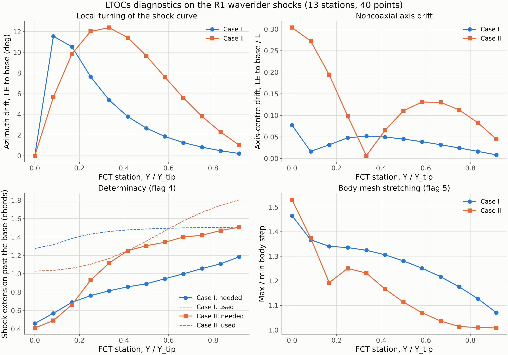

# LTOCs Gate 3 report: LTOCs core

Spec: [`LTOC_implementation_spec.md`](LTOC_implementation_spec.md), Phase 3. Previous gates: [Gate 0](gate0_report.md), [Gate 1](gate1_report.md), [Gate 2](gate2_report.md).
Status: **Phase 3 complete; waiting for approval before Phase 4.** One decision is requested in §6.

---

## 1. What was done

| File | Content |
|---|---|
| `ltoc/ltoc.py` | The LTOCs core, one stream surface per leading-edge point (R1 Sec. II): • `find_leading_edge`: the FCT projected upstream onto the shock (R1 Sec. IV.A). • `solve_stream_surface`: Step A, the shock curve, extended past the base until the body is determined up to it (flag 4). Step B, the noncoaxial inverse MOC on the intrinsic meridian with the streamline mesh (Gate 0 and Gate 1 decisions). Step C, `step_c`, R1 Eqs. 10–11 in vector form. • Refusals with a status and message, and per-stream-surface diagnostics. |
| `ltoc/waverider.py` | `LTOCWaverider`: • lower surface from the body streamlines; • upper surface as the freestream surface through the leading edge (R1 Sec. IV.A); • the WADOS stream protocol (`upper_surface_streams`, `lower_surface_streams`, `leading_edge`, `length`, `width`, `height`, GUI frame), so export, volume and reference-area code work unchanged; • STL/STEP export through `geometry_export`, diagnostics, and the spanwise smoothness metric (flag 8). |
| `ltoc/reference.py` | `osculating_cone_streamline`: the exact lower-surface streamline of an osculating-cone design, plane by plane (V5 reference). |
| `ltoc/moc_noncoaxial.py` | Two changes: • `x_stop`, which ends the march once the body passes the base plane; • the cubic row-foot interpolation is vectorised (same results, faster). One stream surface at 40 points takes about 0.4 s. |
| `ltoc/tests/test_ltoc_core.py` | 10 tests: V4, V5, Step C identities, twisted-surface consistency and order, protocol and export, refusals. The LTOCs suite is now 54 tests, about 36 s. |
| `ltoc/examples/gate3_ltoc_core.py` | Regenerates every figure and number below (about 2 min). |
| `ltoc/docs/validation.md` | Phase 3 tables. |

Existing WADOS methods were not changed.

---

## 2. V4 and V5

| | Reference | Worst body deviation / L (40 points) | Criterion | |
|---|---|---|---|---|
| **V4**: cone shock (M 6, β 12°), 11 stations | tight Taylor–Maccoll streamline | **1.8e−7** | 1e−4 | **pass** |
| | `ShadowWaverider` (existing cone-derived method) | **4.1e−7** | 1e−4 | **pass** |
| **V5**: shock of a WADOS OC design (M 5, β 15°), 10 planes | exact per-plane flow (Taylor–Maccoll in each local cone; wedge flow where the shock is flat) | **8.8e−7** | 1e−4 | **pass** |
| | OC generator's lower surface | 9.0e−4 | — | see below |

On the OC design, LTOCs and the OC generator differ by up to 9e−4 L. That gap is the OC generator's own error. Against the exact per-plane flow, the generator is off by the same 9e−4 L at the same stations, while LTOCs is off by 8.8e−7 L. Its cone angle is 9.2276° instead of 9.2318°, because `waverider_generator/flowfield.py` integrates Taylor–Maccoll with the default `solve_ivp` tolerances. The test asserts that the two deviations agree to 1e−5 L, so "reproduces the existing OC waverider" (spec V5) holds to within that generator's accuracy. The two flat-shock stations, where the generator's wedge flow is exact, agree to 2e−8 L.

---

## 3. Step C: a fix and an accuracy finding

V4 and V5 have planar stream surfaces: a meridian plane of the cone, or an osculating plane. On those, Step C is an exact rigid map, and both converge at the kernel's second order. On the R1 shocks the stream surfaces twist: the shock curves turn by up to 12° in azimuth between the LE and the base (figure 3, right). There is no exact reference there, so I checked self-convergence and an internal consistency test: the 3-D velocity must be tangent to the 3-D body streamline. Off the symmetry plane, this check turned up two things.

**1. Fix: the 3-D velocity at interior points.**
- My first implementation gave the 3-D velocity the same angle to the row segment L–U as in the meridian plane. On a twisted surface the meridian-to-3-D map stretches the row direction and the normal direction by different amounts. The velocity was therefore off the body streamline by a constant 0.25° that did not shrink with refinement.
- R1 says the velocity is "decomposed into three Cartesian velocity components (u, v, and w) according to the geometric relationship of interior points" (R1 Sec. II.C).
- The implementation now maps the meridian flow direction through the triangle's own stretch ratios: |i|/|U − L|ₘ along the segment and |j|/|P − F′|ₘ along j. The angle now goes to zero at first order (0.090° → 0.011° from 20 to 160 points).
- Both ratios are 1 on planar surfaces, so V4 and V5 are unchanged.

**2. Finding: R1's Step C is first-order accurate on twisted stream surfaces.**
- R1 and spec §4.3 place the foot C₂′ on the straight chord A₁A₂ and interpolate linearly. In 3-D, the chord sags off the surface differently from how the meridian chord sags off the meridian row. That gives an O(h²) position error per row, which accumulates to first order along the body.
- Self-convergence of the base-plane body point:

| Case II station | 20 → 40 | 40 → 80 | 80 → 160 | Order | Estimated error at 80 points |
|---|---|---|---|---|---|
| 0.3 | 2.4e−4 | 1.2e−4 | 6.1e−5 | 1.0 | 1.2e−4 L |
| 0.6 | 4.0e−5 | 2.0e−5 | 1.0e−5 | 1.0 | 2.0e−5 L |

- I tried four second-order variants:
  - velocity taken from the 3-D streamline by differences;
  - cubic interpolation of the 3-D rows;
  - the same plus a trapezoidal j;
  - cubic rows with linear end intervals.
- All of them go unstable after 40–100 rows. The cubic row direction feeds position errors back into j and they grow. R1's linear construction is stable and converges cleanly, so it is kept. The order and the mechanism are documented in the `ltoc.ltoc` module docstring.

Right panel of the last figure: the stream surface from FCT station 0.6 leaves the osculating plane of its own leading-edge point. At the base it is 0.026 (1.7 % of L) out of plane on the shock and 0.016 on the body. An osculating method would force this to zero. The same figure on the left shows the noncoaxial axis y − r moving away from the shock curve (R1 Sec. II.B).

---

## 4. Diagnostics on the R1 waverider shocks (spec §6)

Core runs, 13 FCT stations, 40 points. Forces and wall pressures against R1 Tables 2 and 3 are Phase 4.

| | Case I (Eq. 23, M 6, FCT Z = 0.12) | Case II (Eq. 25, M 7, FCT Z = 0.25) |
|---|---|---|
| β on the shock curves | 19.4°–21.8° | 14.7°–23.2° |
| Smallest local radius r | 0.092 | 0.37 |
| Azimuth drift of a shock curve, LE to base | up to 11.6° | up to 12.4° |
| Axis-centre drift, LE to base | up to 0.077 L | up to 0.30 L |
| Shock extension past the base: needed / used (chords) | 0.46–1.18 / 1.28–1.51 | 0.41–1.51 / 1.03–1.80 |
| MOC solves per stream surface | 1 | 1 |
| Max/min body step (flag 5) | ≤ 1.47 | ≤ 1.53 |
| Step C tangency (max angle) | 0.041° | 0.045° |
| Step C fallbacks (ill-conditioned R1 scaling) | 0 | 0 |
| Spanwise smoothness, 13 → 25 stations (flag 8) | 1.1e−2 → 3.9e−3 L | 1.8e−3 → 2.1e−4 L |
| Full-span mesh | closed, 3726 faces | closed, 3726 faces |

- **Determinacy (flag 4).**
  - The body at the base needs shock data well past the base: up to 1.5 chords on case II's outboard stations. This is because the post-shock Mach lines are only a few degrees steeper than the shock.
  - The extension starts at 1.2 times the planar shock-layer estimate and is re-estimated if it falls short. No station needed a second solve.
  - Case II station 0.42 ended with zero margin: the body reached the base on the mesh's last row, which is still a determined result. Its neighbours had 0.05 chords of margin.
  - The analytic shocks extend without trouble. For a shock known only up to the base plane, such as a B-spline fitted to data, this extension requirement will matter.
- **Mesh stretching (flag 5).** The largest body step ratio is 1.53, at the symmetry plane. It varies smoothly, and convergence is clean, so adaptive point insertion is not needed (the spec's "only if Gate 3 shows it is needed").
- **Spanwise smoothness (flag 8).**
  - The metric is a leave-one-out cubic residual of the lower surface at cross-flow cuts, so it measures interpolation error across stations, not noise.
  - It falls 3× to 9× when the stations are doubled, and it is largest next to the symmetry plane. On case I the FCT meets the elliptic cone near its apex there, so neighbouring FCT points map to very different azimuths: stations 0 and 1 are 25° apart.
  - No station-to-station noise was found. For case I in Phase 4, I will cluster stations toward the symmetry plane.

---

## 5. Things in the spec that needed interpretation or turned out differently

1. **§4.3 Step C.** "The speed V at the interior point is then decomposed into (u, v, w) from the geometry of neighbouring points" is implemented as the triangle's meridian-to-3-D map (§3, item 1). Neither the spec nor R1 says that the linear-chord construction is first order on twisted stream surfaces (§3, item 2).
2. **V5 criterion.** "Reproduces the existing osculating-cone waverider" holds against the exact per-plane flow to 8.8e−7 L. Against the OC generator it holds only to 9e−4 L, the generator's own Taylor–Maccoll accuracy.
3. **Flag 8 metric.** The spec does not define one. The leave-one-out cubic residual above is reported per cut by `LTOCWaverider.spanwise_residuals()`.
4. **Flag 7, concave.** "Concave" means the cross-section curves away from the body, κ_b < 0, with the local axis on the freestream side. A shock that wraps around the body, like a cone, has κ_b > 0.

---

## 6. Decision requested

**Accept first-order Step C on twisted stream surfaces for version 1?**

- **Recommendation: accept.**
  - At the default 80 points the worst body error on case II is about 1.2e−4 L, and 2e−5 L on most stations.
  - That is far below the modelling assumption R1 itself makes: the interior-point axis centre equals the shock point's at the same X (R1 Sec. II.B).
  - It should be invisible in the 1 % C_L/C_D targets of V6 and V7. Phase 4 will confirm this by refining n.
- **Alternative:** spend Phase 3b on a stable second-order Step C, for example a global least-squares reconstruction of each row instead of a marching interpolation, before Phase 4. Not needed for the published comparisons.

Unrelated to LTOCs: tightening the Taylor–Maccoll tolerances in `waverider_generator/flowfield.py` would remove the OC generator's 9e−4 L error. I have queued it as a separate suggested task rather than changing an existing method here.

---

## 7. Plan for Phase 4 (published cases, V6–V9)

1. **Panel forces (R1 Eqs. 19–22).**
   - Per quadrilateral panel: area from the diagonals' cross product, mean corner pressure.
   - C_L and C_D referenced to the wetted lower-surface area, at R1's 27 km conditions (P∞ = 1880 Pa, T∞ = 223.54 K).
   - Lower-surface pressure comes from the MOC along each body streamline (`BodyLine.p`).
2. **V6 and V7.** R1 waverider cases I and II against R1 Tables 2 and 3 (LTOCs rows), target 1 %. Wall-pressure distributions laid out like R1 Figs. 23 and 27, and an n-refinement study of C_L, C_D.
3. **V8.** R1 test case II generator (Eq. 18), wall pressure against R1 Fig. 16, qualitative.
4. **V9.** Robustness: flat, concave, sub-Mach-angle and under-determined inputs give the specified messages. Flat, concave and outside-shock are already tested; sub-Mach and under-determined tests will be added.
5. Optional R2 geometry cross-check (W, H, A_w from R2 Table 2).
