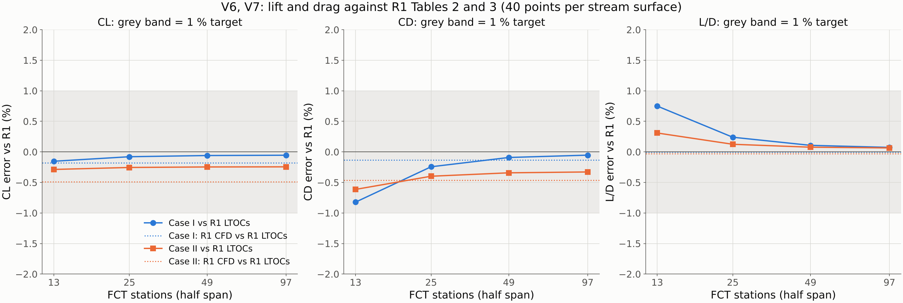
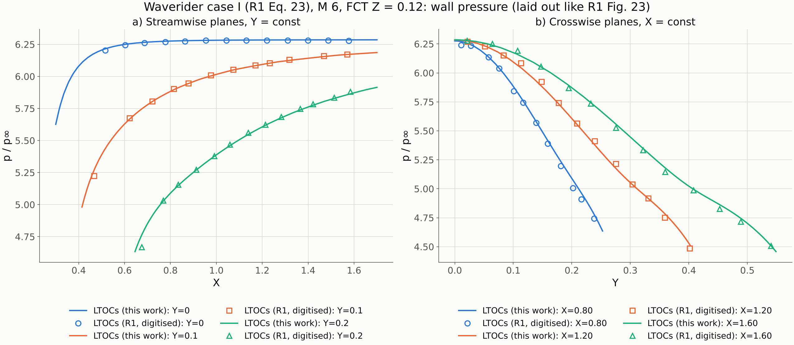
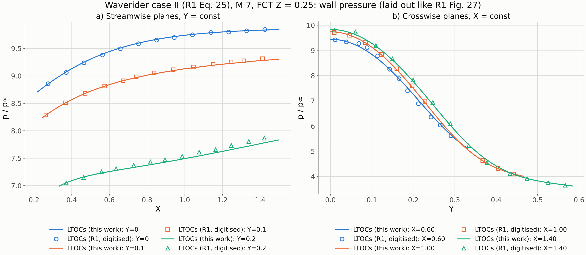
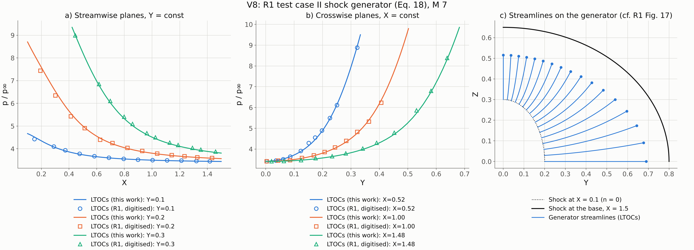
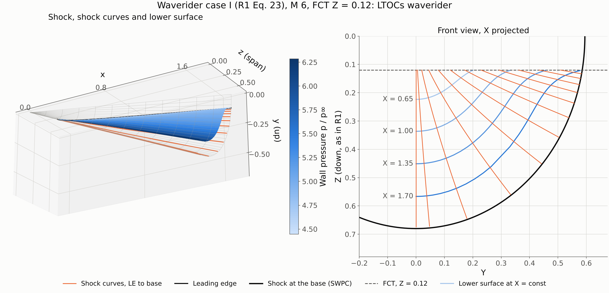
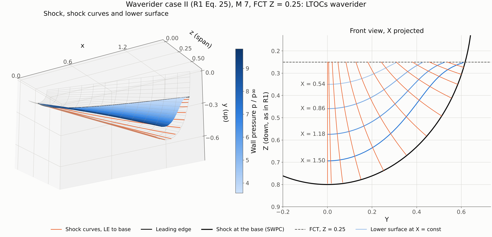

# LTOCs Gate 4 report: published cases (V6–V9)

Spec: [`LTOC_implementation_spec.md`](LTOC_implementation_spec.md), Phase 4. Previous gates: [Gate 0](gate0_report.md), [Gate 1](gate1_report.md), [Gate 2](gate2_report.md), [Gate 3](gate3_report.md).
Status: **Phase 4 complete; waiting for approval before Phase 5 (GUI integration).** No decisions are blocking; §6 lists two points to confirm.

---

## 1. What was done

| File | Content |
|---|---|
| `ltoc/forces.py` | Inviscid lower-surface forces following R1 Eqs. (19)–(22): • lower-surface grid from the body streamlines; • per-panel area from the diagonals and mean corner pressure; • C_L, C_D, L/D with a selectable reference area (planform by default, see §2; wetted also returned). Also wall-pressure sections on streamwise (Y = const) and crosswise (X = const) planes. |
| `ltoc/waverider.py` | `LTOCWaverider.aerodynamics()`. |
| `ltoc/ltoc.py`, `ltoc/shock_surface.py` | Two robustness fixes found by V9 (§4). |
| `ltoc/data/r1_wall_pressure_digitised.json` | R1's LTOCs wall-pressure curves of Figs. 16, 23 and 27, digitised, with the method and accuracy recorded in the file. |
| `ltoc/tests/test_ltoc_published.py` | 12 tests: V6, V7, V8, V9 and the reference-area finding. The LTOCs suite is now 66 tests, about 95 s. |
| `ltoc/examples/gate4_published_cases.py` | Regenerates every figure and number below (about 4 min). |
| `ltoc/docs/validation.md` | Phase 4 tables. |

Existing WADOS methods were not changed. The R1 PDF is not committed. The digitised curves are numbers read off its figures, and their provenance is recorded in the data file.

---

## 2. V6 and V7: R1 Tables 2 and 3

| | C_L | C_D | L/D |
|---|---|---|---|
| **Case I** (Eq. 23, M 6, FCT Z = 0.12), R1 LTOCs | 0.2205 | 0.0750 | 2.9378 |
| This work, 97 stations | **0.22038 (−0.05 %)** | **0.07496 (−0.05 %)** | **2.9400 (+0.07 %)** |
| R1 CFD, for scale | 0.2201 (−0.18 %) | 0.0749 (−0.13 %) | 2.9377 (−0.00 %) |
| **Case II** (Eq. 25, M 7, FCT Z = 0.25), R1 LTOCs | 0.2034 | 0.0648 | 3.1395 |
| This work, 97 stations | **0.20290 (−0.24 %)** | **0.06459 (−0.33 %)** | **3.1415 (+0.06 %)** |
| R1 CFD, for scale | 0.2024 (−0.49 %) | 0.0645 (−0.46 %) | 3.1386 (−0.03 %) |

Both cases are well inside the 1 % target. The differences are of the same size as, or smaller than, the gap between R1's own LTOCs and CFD results.

- **Convergence.**
  - Coefficients converge with the number of FCT stations (figure). With 25 stations every coefficient is within 0.4 %; the CI test uses 25 stations, with a 1 % target and a 0.5 % margin.
  - Going from 40 to 80 points per stream surface changes C_L and C_D by less than 0.03 %. So the first-order Step C accepted at Gate 3 is invisible here, as expected.
- **Stations are clustered toward the symmetry plane.** On case I, 13 uniformly spaced stations give C_D 5 % low, because near the symmetry plane neighbouring FCT points map to very different azimuths (Gate 3 §4). Clustering fixes this: 13 clustered stations give −0.8 %.

**Finding: R1's coefficients use the planform area, not the wetted area.**
- R1 Eq. (22) defines the coefficients with "A, the total wetted area of the waverider", and the spec repeats this.
- With absolute lower-surface pressure and the lower surface's **wetted** area, both cases come out 17–23 % low (C_L 0.1702 and 0.1685, C_D 0.0579 and 0.0536), while L/D is unchanged.
- With the **planform** (projected) area they agree to 0.05–0.33 %. The ratio wetted/planform differs between the cases (1.30 and 1.20), and the planform area fixes both at once, so this is not a fudge factor. It is asserted in a test.
- The rest of the spec's inference holds: absolute pressure, lower surface only, no upper-surface or base contribution. R1 Eq. (19) also leaves out the 1/2 of the quadrilateral area, which cancels in the coefficients.
- `panel_forces` defaults to the planform reference so it reproduces R1, and it reports the wetted-area coefficients too.

---

## 3. Wall pressure: R1 Figs. 23, 27 (V6, V7) and Fig. 16 (V8)

R1's own LTOCs curves were digitised:
- from a 400 dpi render, with axes calibrated on the major ticks;
- the line pixels were selected per column near a coarse by-eye prior, with outliers rejected, and kept as binned medians;
- accuracy is about 0.03 in p/p∞ and 0.003 in X or Y;
- R1's display shifts of ∓0.05 in Fig. 27b were undone.

The CFD symbols were not digitised, since R1 reports them within 2 % of its LTOCs curves.

| | Max / rms deviation from R1's LTOCs curves |
|---|---|
| V6, case I: streamwise Y = 0, 0.1, 0.2 | 0.19/0.09, 0.90/0.20, 1.95/0.42 % |
| V6, case I: crosswise X = 0.8, 1.2, 1.6 | 1.69/0.68, 1.07/0.46, 0.74/0.43 % |
| V7, case II: streamwise Y = 0, 0.1, 0.2 | 0.16/0.09, 0.38/0.21, 1.09/0.71 % |
| V7, case II: crosswise X = 0.6, 1.0, 1.4 | 2.06/1.21, 0.65/0.31, 2.57/0.92 % |
| V8, generator: streamwise Y = 0.1, 0.2, 0.3 | 2.19/0.59, 3.12/1.43, 1.51/1.16 % |
| V8, generator: crosswise X = 0.52, 1.00, 1.48 | 3.28/1.44, 2.35/1.00, 2.33/1.16 % |

- The rms deviations are all within 1.5 %.
- The maxima sit on the steep parts of the curves, where 0.003 of digitising position error alone is worth 2–3 % of pressure.
- R1 reports its own LTOCs-vs-CFD differences as up to 1.4–1.9 %.

**V8 (R1 test case II, Eq. 18).** The "shock generator" is the body traced from the shock's upstream edge (n = 0, the ellipse at X = 0.1). LTOCs reproduces R1 Fig. 16 within the numbers above, and its generator streamlines look like R1 Fig. 17.

One observation concerns the start of R1's Y = 0.2 curve:
- R1 shows about 8.05 at X ≈ 0.12.
- Our curve starts at the exact post-shock pressure 8.70 at X = 0.1, where that plane meets the shock edge (m = 0, β = 23.2°). It falls to 8.47 at X = 0.12 and reaches 8.05 at X ≈ 0.16.

This difference sits on the steepest part of the plot, and it is outside the digitised range used in the test.

The geometry figures show the shock, the shock curves from the leading edge, and the lower surface coloured by wall pressure:

---

## 4. V9: robustness, and two gaps it found

| Input | Result |
|---|---|
| Planar shock (β 15°, M 6) with a curved FCT | the wedge-derived waverider exactly: body slope tan θ to 2e−8, p = p₂ to 3e−7, planar stream surfaces. Panel forces give C_L = p₂/q and L/D = 1/tan θ to 1e−5 |
| Concave cross-section (κ_b < 0) | `concave`, "... (spec flag 7: refused)" |
| Cone β 8° at M 6 (below the Mach angle) | `sub_mach`, "... (spec flag 7: refused)" |
| Cone β 75° at M 3 (beyond detachment) | `detached`, "... (spec flag 7: refused)" |
| Shock extension capped at 0.1 chords | `undetermined`, "... (spec flag 4)" |
| B-spline shock whose data end at the base plane | `undetermined`, "the shock data end at X = ... (spec flag 4: extend the shock surface past the base plane)" |
| FCT point outside the shock at the base | `outside_shock`; the stream-protocol attributes raise "waverider incomplete" |

Two gaps were found and fixed:

1. **Sub-Mach shock crashed.** It raised a bare `ValueError` from the Rankine–Hugoniot call in the shock-extension estimate, before the flag check could refuse it. The estimate is now skipped outside (Mach angle, detachment), and the flag check refuses the stream surface with its message.
2. **Data shocks were extrapolated silently.** Extending a `BSplineShock` past its data produced garbage, which ended in a crash.
   - Shock surfaces now declare `analytic` (True for ruled, cone and OC shocks, which are closed forms; False for B-splines).
   - A data shock's curve stops at the end of its data. If the body is then not determined up to the base, the stream surface is refused (flag 4).
   - With data past the base, a B-spline cone gives the same body as the analytic cone to 9e−7.

Any remaining MOC or initial-line error becomes a `moc_error` status instead of an exception.

---

## 5. Things in the spec or the papers that turned out differently

1. **Reference area (R1 Eq. 22; spec §4.4).** It is the planform area, not the "total wetted area" (§2). This is the main finding of this gate.
2. **R1 Eq. (19)** leaves out the factor 1/2 of the quadrilateral area. It cancels in the coefficients; the code uses the true area.
3. **Spec §4.4 inference confirmed:** absolute lower-surface pressure, and no upper-surface or base contribution.
4. **R1 Fig. 27b** shifts two of its curves by ∓0.05 in Y for display (stated in R1 Sec. IV.C); the comparison undoes the shift.
5. **Station distribution matters** near a symmetry plane where the FCT meets the shock close to the apex (case I). Not mentioned in R1; handled by clustering.

---

## 6. To confirm, and plan for Phase 5

**To confirm:**
- (a) Planform as the default reference area for LTOCs coefficients in WADOS. The GUI can show both.
- (b) The optional R2 geometry cross-check (W, H, A_w from R2 Table 2) was not done. It uses a different method, and its frame needs reconciling first. I would leave it out unless you want it.

**Phase 5 (integration):**
1. A GUI tab "LTOCs waverider" following the existing tab pattern, with:
   - shock input: ruled-surface presets (R1 cases I and II, test case II, cone) and an OC-design import;
   - FCT input: Z = const line with a station count, clustered at the symmetry plane;
   - Mach, number of points.
2. Run, with progress per stream surface and a clear refusal list (flags 4 and 7).
3. Views: shock with shock curves, lower surface coloured by p/p∞, β/r/axis-drift diagnostics, wall-pressure sections. C_L, C_D, L/D with both reference areas.
4. Export STL/STEP through `geometry_export`, as the other tabs do. Hook into the method registry so the existing analysis paths (PySAGAS, volume, reference area) accept the waverider through the stream protocol.
5. A short user page with the references of spec §3.
