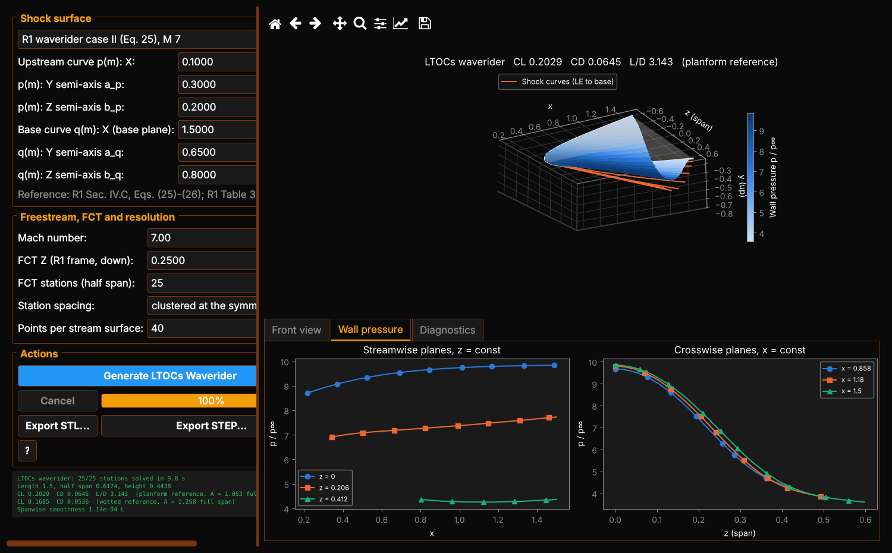

# LTOCs Gate 5 report: integration

Spec: [`LTOC_implementation_spec.md`](LTOC_implementation_spec.md), Phase 5. Previous gates: [0](gate0_report.md), [1](gate1_report.md), [2](gate2_report.md), [3](gate3_report.md), [4](gate4_report.md).
Status: **Phase 5 complete. All five phases of the spec are done.** No decisions are pending; §5 lists optional follow-ups.

---

## 1. What was done

| File | Content |
|---|---|
| `ltoc_waverider_tab.py` | The **LTOCs Waverider** tab, laid out like the GVWD/PSWR tabs. |
| `ltoc/design.py` | The tab's logic, with no Qt, so CI tests it: • `LTOCDesign` (inputs and validation) and `LTOCResult` (waverider, forces, grid, refusals, plotting data, summary); • presets for R1 cases I, II, test case II and a cone; • `EllipticShock` (R1 Eq. 15). |
| `ltoc/waverider.py` | `progress(done, total)` callback with cancellation, for the GUI thread. |
| `waverider_gui.py` | Registration following the existing pattern (an `ImportError`-guarded import and an `addTab` block, tab 14). An optional "LTOCs Waverider" source in `MeshSelectDialog`, passed at its three call sites. The change is additive; existing sources behave as before. |
| `ltoc/tests/test_ltoc_design.py`, `test_ltoc_gui.py` | 13 design tests (CI) and 5 offscreen Qt tests (skipped without PyQt5, as in CI). The LTOCs suite is now 84 tests. |
| `docs/ltoc/user_guide.md` | The user page: the tab, the library, what to know, and the references of spec §3. |
| `README.md` | LTOCs added to the methods table, layout, documentation and testing sections. |

The tab's three parts:
- **Inputs:** shock source (R1 presets, a custom elliptic ruled shock, or import of the current OC design), Mach number, FCT Z, number of stations, station spacing (clustered at the symmetry plane by default), points per stream surface.
- **Run:** a background thread with a per-station progress bar and a cancel button. Refused stations are listed with their status and flag message; no geometry is built, and the exports stay disabled.
- **Views and outputs:**
  - 3-D (lower surface coloured by p/p∞, upper surface, shock curves, leading edge);
  - front view (base-plane shock trace, FCT, lower-surface sections, the turning shock curves);
  - wall pressure on streamwise and crosswise planes;
  - per-station diagnostics (azimuth drift, axis drift, determinacy, body step ratio);
  - summary: C_L, C_D, L/D with the planform reference (as approved at Gate 4) and the wetted values;
  - STL (metres) and STEP (millimetres) export in the GUI frame;
  - a help dialog with the method, refusals and references.

*R1 waverider case II at the GUI defaults: 25 stations, 40 points, 9.8 s. C_L 0.2029, C_D 0.0645, L/D 3.143, against R1 Table 3's 0.2034, 0.0648, 3.1395.*

---

## 2. How LTOCs reaches the rest of WADOS

| Path | How |
|---|---|
| Aero Analysis (preview, PySAGAS, AeroDeck) | **Direct.** The mesh dialog now offers *LTOCs Waverider*, which writes the closed full-span mesh to a temporary binary STL. Checked: meshio (PySAGAS's reader) and numpy-stl (the preview) both read it, with 1230 triangles in the test case. Other methods, except the cone-derived one, hand off only through an exported file. |
| Export | `LTOCWaverider.export_stl/export_step` through `geometry_export`, with the same conventions as the other tabs: STL in metres, STEP in millimetres, GUI frame. |
| Stream protocol | `LTOCWaverider` exposes `upper/lower_surface_streams`, `leading_edge`, `length`, `width`, `height` in the GUI frame (Gate 0 §1.3), so volume, reference-area and CAD code that consumes the protocol accepts it. |
| Method registry | The spec asked for one, but WADOS has none (Gate 0 §1.1). The tab is registered the way every other method is: an import flag plus an `addTab` block. |
| OC design to LTOCs | The tab can import the design last generated in the OC Waverider tab. LTOCs then reproduces it, which puts validation case V5 in the GUI. |

**Theme.** The hub sets a dark palette and dark matplotlib defaults in `main()`. The tab takes its neutral line and text colours from the active matplotlib theme, so it reads correctly in the hub and when run standalone. A first version drew black lines and legend text, which would have been invisible in the hub; this was caught by rendering under the hub's actual palette and stylesheet.

---

## 3. Tests

| Suite | Result |
|---|---|
| `ltoc/tests` (all phases) | **84 passed**, about 2 min locally (PyQt5 installed). In CI the 5 GUI tests skip and 79 run. |
| `gvwd/tests`, `waverider_generator/tests` | 186 passed (unchanged by this phase) |

The Phase 5 checks are listed in [`ltoc/docs/validation.md`](../../ltoc/docs/validation.md#phase-5-integration-ltocdesignpy-ltoc_waverider_tabpy). The hub was also started offscreen with the tab registered. The OC parameter panel is hidden on the LTOCs tab, a design solves inside the hub, and the mesh dialog hands it to the analysis.

---

## 4. Summary of the whole implementation

| Phase | Result |
|---|---|
| 1. Noncoaxial MOC kernel | Two-family rotational inverse MOC, streamline mesh. V1: Taylor–Maccoll to 0.1 % with order 2. V2: uniform flow to round-off. |
| 2. Shock geometry | β, r = cos β / κ_b, shock curves (RK4). V3, plus R1 Eq. (1)'s sign corrected. |
| 3. LTOCs core | Steps A–C and the waverider with the stream protocol. V4: 1.8e−7 L. V5: 8.8e−7 L. Step C is first order on twisted stream surfaces (accepted). |
| 4. Published cases | R1 Tables 2 and 3 to 0.05–0.33 %, using the planform area. R1 wall pressure within 1.5 % rms. V9 robustness, with two gaps fixed. |
| 5. Integration | GUI tab, Aero Analysis hand-off, user guide. |

Findings that differ from the papers or the spec are collected in the gate reports:
- R1 Eq. (1) sign (Gate 2);
- the one-relation-short unit process (Gate 0);
- Step C velocity reconstruction and order (Gate 3);
- the reference area and R1 Eq. (19)'s factor 1/2 (Gate 4);
- data shocks must not be extrapolated (Gate 4).

---

## 5. Optional follow-ups (not started)

1. **Project save/load.** WADOS saves only five methods in project files (Gate 0 §1.5); LTOCs is not among them. Adding it means storing `LTOCDesign`, which is a small dataclass.
2. **More shock inputs in the GUI.** The library also takes `RuledShock` with arbitrary p(m), q(m) and `BSplineShock` (data); the tab offers elliptic ruled shocks and the OC import. A table or CSV input for B-spline shocks would expose the rest.
3. **Second-order Step C** for twisted stream surfaces (Gate 3 §6, deferred by your decision).
4. **The suggested task** on the OC generator's Taylor–Maccoll tolerances (about 9e−4 L error in that generator; Gate 3).
